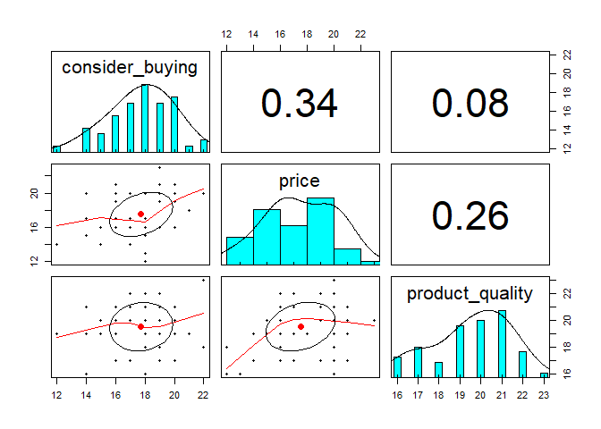
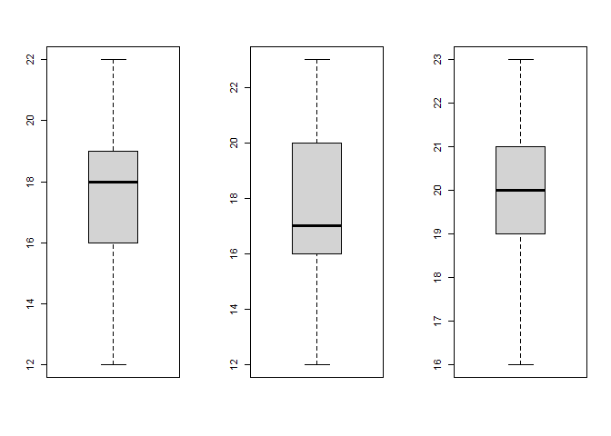
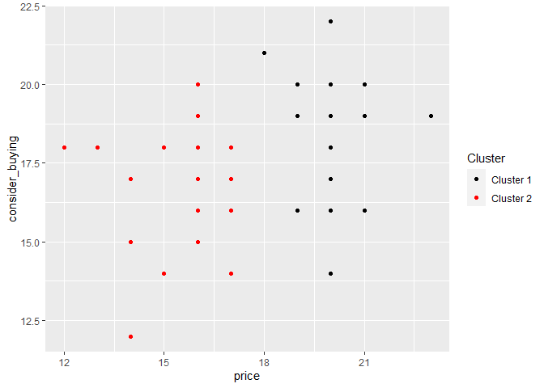

Modeling Purchasing Decisions for Customers at Dapur Putih Cafe Metro
================

This project inspired from a thesis called “Pengaruh Tingkat Harga dan
Kualitas Produk Terhadap Keputusan Pembelian bagi Konsumen di Dapur
Putih Cafe Metro” by Nella Fanitawati in 2020. The data used is also
from the thesis itself. The data was generated by Nella Fanitawati from
her survey using a questionnaire with a random sampling technique for
customers at Dapur Putih Cafe. There are **53 respondents** in the
survey.

Dapur Putih Cafe is one of the places to eat in the Metro City that
offers food and drinks as well as a comfortable place to hang out. It
also offered affordable prices for its products.

The main problem statement was: **How to analyze the influence of the
price level and product quality on customer decisions to buy Dapur Putih
Cafe’s products?**

To answer that, we can fit a linear regression model and check if the
beta coefficient for its independent variables is significant or not.

``` r
# Import libraries
library(tidyverse)
```

    ## -- Attaching packages --------------------------------------- tidyverse 1.3.1 --

    ## v ggplot2 3.3.5     v purrr   0.3.4
    ## v tibble  3.1.6     v dplyr   1.0.7
    ## v tidyr   1.1.4     v stringr 1.4.0
    ## v readr   2.1.1     v forcats 0.5.1

    ## -- Conflicts ------------------------------------------ tidyverse_conflicts() --
    ## x dplyr::filter() masks stats::filter()
    ## x dplyr::lag()    masks stats::lag()

``` r
library(readxl)
library(skimr)
library(lmtest)
```

    ## Loading required package: zoo

    ## 
    ## Attaching package: 'zoo'

    ## The following objects are masked from 'package:base':
    ## 
    ##     as.Date, as.Date.numeric

``` r
library(psych)
```

    ## 
    ## Attaching package: 'psych'

    ## The following objects are masked from 'package:ggplot2':
    ## 
    ##     %+%, alpha

``` r
# Import data
df <- read_xlsx("Dapur Putih Cafe.xlsx")
df
```

    ## # A tibble: 53 x 3
    ##    consider_buying price product_quality
    ##              <dbl> <dbl>           <dbl>
    ##  1              16    21              19
    ##  2              19    20              21
    ##  3              16    17              21
    ##  4              16    19              20
    ##  5              21    18              19
    ##  6              17    17              21
    ##  7              15    16              20
    ##  8              19    21              17
    ##  9              20    20              21
    ## 10              19    19              22
    ## # ... with 43 more rows

There are three variables in the dataset which are consider_buying,
price, and product_quality. The dependent variable in this dataset is
consider_buying and the remaining variables are the independent
variables. Below is the description of each of those variables:

-   consider_buying: a condition in which customers decide whether to
    buy the Dapur Putih Cafe products or not.
-   price: the price of products in Dapur Putih Cafe that is based on
    the affordability of the given prices and the value.
-   product_quality: The quality of products in Dapur Putih Cafe.

The values of each variable lie within 5-25 as integers (no decimals).
But, we could treat it as a continuous value in regression.

``` r
# Skim the data
skim(df)
```

|                                                  |      |
|:-------------------------------------------------|:-----|
| Name                                             | df   |
| Number of rows                                   | 53   |
| Number of columns                                | 3    |
| \_\_\_\_\_\_\_\_\_\_\_\_\_\_\_\_\_\_\_\_\_\_\_   |      |
| Column type frequency:                           |      |
| numeric                                          | 3    |
| \_\_\_\_\_\_\_\_\_\_\_\_\_\_\_\_\_\_\_\_\_\_\_\_ |      |
| Group variables                                  | None |

Data summary

**Variable type: numeric**

| skim_variable   | n_missing | complete_rate |  mean |   sd |  p0 | p25 | p50 | p75 | p100 | hist  |
|:----------------|----------:|--------------:|------:|-----:|----:|----:|----:|----:|-----:|:------|
| consider_buying |         0 |             1 | 17.74 | 2.15 |  12 |  16 |  18 |  19 |   22 | ▂▃▇▇▁ |
| price           |         0 |             1 | 17.51 | 2.59 |  12 |  16 |  17 |  20 |   23 | ▃▆▅▇▂ |
| product_quality |         0 |             1 | 19.55 | 1.81 |  16 |  19 |  20 |  21 |   23 | ▃▁▇▅▂ |

After we skim the data, we can see some metrics and a histogram for each
variable. As you can see product_quality has the highest mean and median
compared to the other variables. It means that the quality of products
in Dapur Putih Cafe is reasonably high compared to its prices.

Furthermore, we need to check if there is any clear patterns that shown
a relationship between each independent variables on its dependent
variable. We can create scatterplots and calculate its spearman
correlation coefficient (spearman correlation used cause it does not
have assumption about the distribution of the data).

``` r
# Check if there is any clear of relationship pattern
pairs.panels(df, method = "spearman")
```

<!-- -->

From the plot above, we can see that our dependent variable has a higher
correlation coefficient with price rather than product_quality.
Therefore, we could conclude that customers have a greater chance to buy
Dapur Putih Cafe’s products because it has affordable prices.

Before we get into modeling, we need to check of there is any outlier in
the data based on each of its variable. We can use boxplot to visualize
and check the outliers.

``` r
# Check if there is any outliers in the data using boxplot
par(mfrow = c(1, 3))
boxplot(df$consider_buying)
boxplot(df$price)
boxplot(df$product_quality)
```

<!-- --> From each of
the boxplot we can see that there is no outliers in the data. Then, we
could prepare the data for modeling by splitting the data randomly into
training and test set with 90:10 ratios.

``` r
# Split the data into train and test set
set.seed(123)
train_set = sample(1:nrow(df), round(0.9 * nrow(df), 0))
df_train <- df[train_set,]
df_test <- df[-train_set,]
```

Then, we fit the data using linear regression.

``` r
# Fitting linear regression model
model <- lm(consider_buying ~ ., data = df_train)
summary(model)
```

    ## 
    ## Call:
    ## lm(formula = consider_buying ~ ., data = df_train)
    ## 
    ## Residuals:
    ##    Min     1Q Median     3Q    Max 
    ## -4.724 -1.573  0.420  1.635  3.667 
    ## 
    ## Coefficients:
    ##                 Estimate Std. Error t value Pr(>|t|)   
    ## (Intercept)     12.58581    3.65613   3.442  0.00126 **
    ## price            0.27125    0.12582   2.156  0.03647 * 
    ## product_quality  0.01792    0.17865   0.100  0.92055   
    ## ---
    ## Signif. codes:  0 '***' 0.001 '**' 0.01 '*' 0.05 '.' 0.1 ' ' 1
    ## 
    ## Residual standard error: 2.146 on 45 degrees of freedom
    ## Multiple R-squared:  0.1013, Adjusted R-squared:  0.06136 
    ## F-statistic: 2.536 on 2 and 45 DF,  p-value: 0.09043

We use 5% significance level in our hypothesis testing for the inference
in the regression modeling. Unfortunately, we can see that our
independent variables is not simultaneously significant. It is shown
from the p-value of F-statistic that is 0.09043 and it is less than the
5% significance level. Therefore, we cannot solve the main problem
statement based on our independent variables.

For each of the regression coefficient (beta), we can see that
product_quality is the only one that does not have significant effect on
the dependent variable. It is based on its p-value (Pr>\|t\|) with
0.71261 that less than 5% significance level. We can remove this
independent variable from to get the best model for our problem.

Furthermore, we can see that our model has R-squared with 10.13% and it
is relatively low. It could be solved by adding mode independent
variables in the linear regression model. But, in this experiment there
are only two independent variables that we could use for modeling.
Maybe, the researcher should consider to add more independent variables
that could explain the costumer consideration in the experiment to
decide whether they want to buy the products of Dapur Putih Cafe or not.
The investigation to add more independent variables could be done by
studying more pieces of literature to get a better understanding for
deciding which independent variables she could use.

Then, we need to remove product_quality from the model and fit the
linear regression model once again.

``` r
# Fitting linear regression model but without product_quality
model <- lm(consider_buying ~ price, data = df_train)
summary(model)
```

    ## 
    ## Call:
    ## lm(formula = consider_buying ~ price, data = df_train)
    ## 
    ## Residuals:
    ##     Min      1Q  Median      3Q     Max 
    ## -4.7236 -1.5466  0.4046  1.6303  3.6303 
    ## 
    ## Coefficients:
    ##             Estimate Std. Error t value Pr(>|t|)    
    ## (Intercept)  12.8825     2.1255   6.061 2.35e-07 ***
    ## price         0.2744     0.1206   2.275   0.0276 *  
    ## ---
    ## Signif. codes:  0 '***' 0.001 '**' 0.01 '*' 0.05 '.' 0.1 ' ' 1
    ## 
    ## Residual standard error: 2.123 on 46 degrees of freedom
    ## Multiple R-squared:  0.1011, Adjusted R-squared:  0.08156 
    ## F-statistic: 5.174 on 1 and 46 DF,  p-value: 0.02764

The adjusted R-squared from the evaluated model is higher than the
initial model that has product_quality as its second independent
variable. The R-squared is also has a relatively the same value, it just
drop from 10.13% to 10.11%. Therefore, we can conclude that our that our
evaluated model is better than the initial model.

After that, we can check if our model is valid by checking if the
assumption is already fulfilled. There are two main assumption that we
need to check which are the normality of the residual and the
homoscedasticity of its residual variance.

``` r
# Model assumption checking

# Normality test for residual
shapiro.test(model$residuals)
```

    ## 
    ##  Shapiro-Wilk normality test
    ## 
    ## data:  model$residuals
    ## W = 0.95494, p-value = 0.06304

``` r
# Heteroscedasticity test
bptest(model)
```

    ## 
    ##  studentized Breusch-Pagan test
    ## 
    ## data:  model
    ## BP = 0.23993, df = 1, p-value = 0.6243

From both of the Shapiro-Wilk and Breusch-Pagan test we can conclude
that our model is valid. The model’s residuals has normal distribution
and its variance is homoscedastic. It is shown by the p-value of each
test that is greater than 5% significance level.

Therefore, we can generate insights from the model by interpreting its
regression coefficient. From the model, we can conclude that price has a
significant effect on consider_buying as its dependent variable with a
0.2744 coefficient value. From its coefficient value, the price has a
positive effect on consider_buying. It means that the more value and
affordable the prices are then the customer is likely to buy products
from Dapur Putih Cafe. Mathematically speaking, if the price variable
increases a unit, then the consider_buying will be increased by 27.44%.

Next, we need to calculate our model’s prediction performance using Root
Mean Squared Error (RMSE) and Mean Absolute Percentage Error (MAPE) for
the test set.

``` r
# Prediction performance

# Predict test data
y_test_pred <- predict(model, df_test[-1])

# RMSE
rmse <- function(y_true, y_pred){
  mse <- mean((y_true - y_pred) ^ 2)
  return(sqrt(mse))
}
cat("RMSE =", rmse(df_test$consider_buying, y_test_pred), "\n")
```

    ## RMSE = 1.197779

``` r
# MAPE
mape <- function(y_true, y_pred){
  return((mean(abs(y_true - y_pred) / y_true) * 100))
}
cat("MAPE =", mape(df_test$consider_buying, y_test_pred))
```

    ## MAPE = 5.774701

Our model has good performance for predicting the customer consideration
to buy the Dapur Putih Cafe’s products from its prices (affordability
and value). RMSE and MAPE that we have got are 1.197779 and 5.774701
respectively. Therefore, our model can be used to predict customer
buying decisions based on the product prices at Dapur Putih Cafe.

We can expand the main problem statement from linear regression modeling
into a **segmentation problem**. Variables that we could use are
consider_buying and price (as it’s the only significant independent
variable from the regression modeling). Our concern for this
segmentation problem is to create two clusters of customers based on
consider_buying and price variables. The method that we will use is
**K-means clustering**.

``` r
# Clustering customers
cluster_customer <- kmeans(df[-3], 2)
cluster_customer
```

    ## K-means clustering with 2 clusters of sizes 23, 30
    ## 
    ## Cluster means:
    ##   consider_buying    price
    ## 1        18.69565 20.04348
    ## 2        17.00000 15.56667
    ## 
    ## Clustering vector:
    ##  [1] 1 1 2 1 1 2 2 1 1 1 2 1 1 1 2 2 2 2 2 2 1 2 2 2 2 2 2 2 1 2 2 2 1 2 2 1 2 1
    ## [39] 1 1 2 2 1 2 2 1 2 2 1 2 1 1 1
    ## 
    ## Within cluster sum of squares by cluster:
    ## [1] 131.8261 159.3667
    ##  (between_SS / total_SS =  50.6 %)
    ## 
    ## Available components:
    ## 
    ## [1] "cluster"      "centers"      "totss"        "withinss"     "tot.withinss"
    ## [6] "betweenss"    "size"         "iter"         "ifault"

We can see that the K-means clustering technique has successfully
created two customers clusters based on consider_buying and price
variables. The first cluster center has the highest value of both
consider_buying and price variables than the second cluster center. The
first cluster consists of 23 customers and the second cluster consists
of 30 customers.

Next, we create a plot to visualize the clusters using the ggplot2
library. But first, we need to prepare the data by creating a data frame
with three columns that consists of consider_buying, price, and cluster.

``` r
# Add a column to store cluster
df <- df %>% select(-product_quality) %>% mutate(cluster = cluster_customer$cluster)
df
```

    ## # A tibble: 53 x 3
    ##    consider_buying price cluster
    ##              <dbl> <dbl>   <int>
    ##  1              16    21       1
    ##  2              19    20       1
    ##  3              16    17       2
    ##  4              16    19       1
    ##  5              21    18       1
    ##  6              17    17       2
    ##  7              15    16       2
    ##  8              19    21       1
    ##  9              20    20       1
    ## 10              19    19       1
    ## # ... with 43 more rows

After that, we can visualize the cluster using ggplot2.

``` r
# Create a plot to visualize the cluster
ggplot(df, aes(price, consider_buying)) +
  geom_point(aes(colour = cut(cluster, c(-Inf, 1.5, Inf)))) +
  scale_color_manual(name = "Cluster",
                     values = c("(-Inf,1.5]" = "black",
                                  "(1.5, Inf]" = "red"),
                     labels = c("Cluster 1", "Cluster 2"))
```

<!-- -->

From the plot above we can see that the first cluster has higher prices
and relatively higher values of consider_buying than the second cluster.
The owner or manager of Dapur Putih Cafe should elaborating this finding
to optimize its revenue from customers that buy its products.

Customers in the first cluster would love to buy Dapur Putih Cafe’s
products because it has affordable prices with good values based on its
prices. Therefore, Dapur Putih Cafe should **add a category for products
that has the cheapest price but with reasonable values for its customers
to enjoy**. This particular category is made especially for customers
that reside in the first cluster. If we look at the result of the linear
regression modeling, this strategic approach can also make customers in
the second cluster to be more likely to buy Dapur Putih Cafe’s products.

## Conclusion

The price variable has a significant effect on consider_buying, but
product_quality is not. The price’s regression coefficient value is
0.2744, which means that if the price variable increases a unit, then
the consider_buying will be increased by 27.44%. Therefore, the more
value and affordable the prices are then the customer is likely to buy
products from Dapur Putih Cafe. Dapur Putih Cafe should **add a category
for products that has the cheapest price but with reasonable values for
its customers to enjoy**.

The researcher should consider adding more independent variables that
could explain the customer consideration in the experiment to decide
whether they want to buy the products of Dapur Putih Cafe or not. The
investigation to add more independent variables could be done by
studying more pieces of literature to get a better understanding for
deciding which independent variables could be used.

RMSE and MAPE that we have got for the test data are 1.197779 and
5.774701 respectively. It means that our model has a good performance to
predict the consider_buying variable.

## Reference

Fanitawati, Nella. 2020. *Pengaruh Tingkat Harga dan Kualitas Produk
Terhadap Keputusan Pembelian Bagi Konsumen di Dapur Putih Cafe Metro*.
Undergraduate Thesis. Metro: Institut Agama Islam Negeri (IAIN) Metro.
